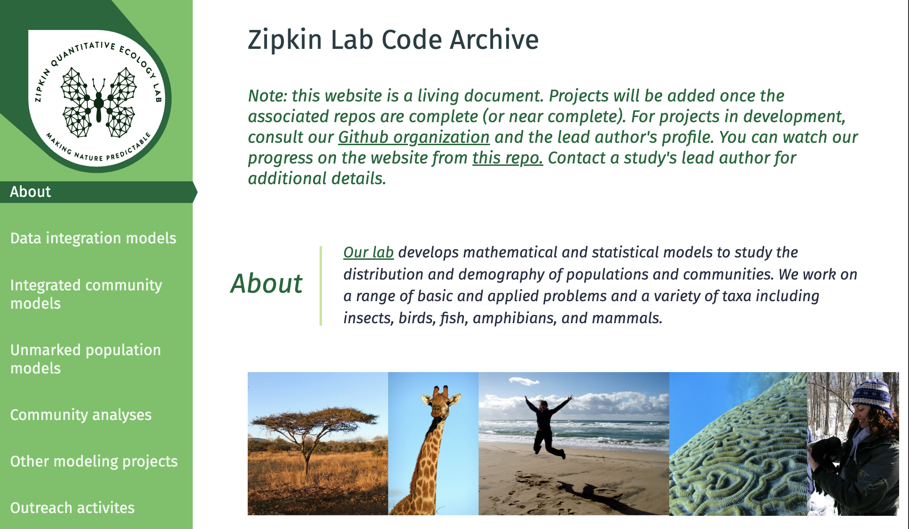

<br>
Steps and information for adding a new GitHub repository to the [Zipkin Lab Code Archive](https://zipkinlab.github.io/) front-face page, if you are one of the GitHub people. This is the website where all our code and data can live through eternity, and where we can direct people who ask about our analysis or data. The [Lab Code Archive](https://github.com/zipkinlab/zipkinlab.github.io) is one repository that lives within the [Zipkin Lab's GitHub](https://github.com/zipkinlab) page.



<br>

<b>These are the steps:</b>

<b>1</b> - All repos should be on the Zipkin Lab GitHub and be linked from there (not from personal GitHub accounts) to the front-facing page. So step one is forking someone's repository into it.

<b>2</b> - Make sure all the necessary information is available. There are two documents to use as reference that are on the [Zipkin Lab Teams GitHub page](https://teams.microsoft.com/l/channel/19%3A15762ca26189456f989a45136b141e94%40thread.tacv2/GitHub?groupId=a1e331a0-3ad7-4671-a13e-3629dea6fd3b&tenantId=22177130-642f-41d9-9211-74237ad5687d) (ZipkinLab -> GitHub -> Files):

  * a checklist to keep track of which papers are added, and which information is necessary. This is [GithubProjects.xlsx](https://michiganstate.sharepoint.com/:w:/r/sites/STUOT-ResearchGroup/Shared%20Documents/GitHub/Github%20Project%20Checklist.docx?d=w2c29be3eda324515bb264af68f3b242f&csf=1&web=1&e=okdI3w), and you should add info there.

  * a document with more detailed intructions on the information that should be present in a repository. This is [Github Project Checklist.docx](https://michiganstate.sharepoint.com/:x:/r/sites/STUOT-ResearchGroup/Shared%20Documents/GitHub/GithubProjects.xlsx?d=w6e21ffea9efe45ce993b24157dfe59be&csf=1&web=1&e=8rDe1n)

<b>3</b> - Front-Facing edits:

  * edits are done in the [index.html file](https://github.com/zipkinlab/zipkinlab.github.io/blob/master/index.html) (go to the editor!)

  * the html code chunk to add the new information has to be inserted within the paper category (e.g. community models, unmarked population models). New papers go on the top of the section.

  * this code creates html code for both the <b>citation short title to go on top</b> (git_title.txt), and the <b>information about the paper and data</b> (git_text.txt)

    + first, enter the information for the paper in this [csv file](https://michiganstate.sharepoint.com/:x:/r/sites/STUOT-ResearchGroup/Shared%20Documents/GitHub/github_dat.csv?d=w5d117ec80bf7495283bcbb7380150816&csf=1&web=1&e=klx6tk). This will be the information that will be used to create the html text:


```{r, echo = FALSE, message = FALSE}
library(tidyverse)

# Create the data
dat <- tibble(
  data = c("section", "citation", "title", "year", "journal", "fig_height", "fig_width", "abstract", 
           "author1", "github1", "author2", "github2", "author3", "github3", "author4", "github4", 
           "numb_authors", "doi", "doi_addr"),
  info = c("Data integration models", "Davis_etal_2025_EcoApps", 
           "Evaluating environmental drivers and synchrony of Arctic shorebird demographic rates to inform conservation management", 
           "2025", "Ecological Applications", "2128", "2193", 
           "Environmental factors affect the population dynamics of migratory species throughout their annual cycles. However, identifying the", 
           "Davis, K.L.", "https://github.com/davisk93", "Lanctot, R.B.", "NA", "Saalfeld, S.T.", "NA", 
           "Zipkin, E.F.", "https://github.com/zipkinlab", "4", "10.1111/2041-210X.14282", 
           "https://besjournals.onlinelibrary.wiley.com/doi/full/10.1111/2041-210X.14282")
)

knitr::kable(dat, format = "html", caption = "Example of Information Needed for the Paper")
```

<br>

+ run [this script](https://michiganstate.sharepoint.com/:u:/r/sites/STUOT-ResearchGroup/Shared%20Documents/GitHub/github_html.r?csf=1&web=1&e=kJIER0) using the file, or here:
<br>
```{r, eval = F, echo = T}
## code to create html file for the lab front facing page

library(glue)
library(tidyverse)

dat <- read_csv("github_dat.csv")

id_codes <- c("icm", "dataintegration", "other", "community", "unmarked")
id_names <- c("Integrated community models", "Data integration models", "Other projects", "Community analyses", "Unmarked population models")

id_cd <- cbind(id_codes, id_names) %>% as_tibble()

this_id <- pull(dat[which(dat$data == "section"),2])

id <- paste0(gsub(" ", "",tolower(id_cd[which(id_cd$id_names == this_id),1])),
            dat[which(dat$data == "year"),2],
            toupper(substr(dat[which(dat$data == "author1"),2],1,1)))

citation <- dat[which(dat$data == "citation"),2]  %>% pull()

figure <- glue("assets/images/{citation}.png")
git_repo <- glue("https://github.com/zipkinlab/{citation}")
title <- pull(dat[which(dat$data == "title"),2])

FigSize <- function(OriginalWidth, OriginalHeight, OutputWidth = 200){
  WidthRatio <- OutputWidth / OriginalWidth
  OutputHeight <- OriginalHeight * WidthRatio
  #cat(paste0('Width = ', round(OutputWidth), '\nHeight = ', round(OutputHeight)))
  return(list(round(OutputWidth), round(OutputHeight)))
}

fig_height <- pull(dat[which(dat$data == "fig_height"),2]) %>% as.numeric()
fig_width <- pull(dat[which(dat$data == "fig_width"),2]) %>% as.numeric()

res_fig <- FigSize(OriginalWidth = fig_width, OriginalHeight = fig_height)

fig_width2 <- res_fig[[1]][1]
fig_height2 <- res_fig[[2]][1]

journal <- pull(dat[which(dat$data == "journal"),2])
year <- pull(dat[which(dat$data == "year"),2])

doi <- pull(dat[which(dat$data == "doi"),2])
doi_addr <- pull(dat[which(dat$data == "doi_addr"),2])

abstract <- pull(dat[which(dat$data == "abstract"),2])
numb_authors <- pull(dat[which(dat$data == "numb_authors"),2]) %>% as.numeric()

gitlink <- glue("https://github.com/zipkinlab/{citation}")

html_content1 <- glue_collapse(glue(" <h3 id='{id}'>{citation}</h3>
  <section class='example'>
    <section class='title'>
      <h1>{title}</h1>
      
          <div class='modal' id='{gsub('etal', 'et al.', gsub('_', ' ',citation))}'>
        <span class='close'>&times;</span>
        
        <div class='modal-caption'></div>
        </div>
    </section>
    <section class='content'>
      <p>
<strong>Citation</strong> - "))


for(i in 1:numb_authors){
  
  author_loop <- glue("author{i}")
  assign(author_loop, as.character(glue("{pull(dat[which(dat$data == author_loop),2])}")))

  gitaut_loop <- glue("github{i}")
  assign(gitaut_loop, pull(dat[which(dat$data == gitaut_loop),2]))
  
  if (is.na(get(gitaut_loop))) {
        if (i == 1){ ht2 <- paste0(get(author_loop),", ")}
        if (i > 1 & i < numb_authors){ ht2 <- c(ht2, paste0(get(author_loop),", "))}
        if (i ==numb_authors){ ht2 <- c(ht2, paste0(get(author_loop),", "))}
        
            } else {

            if (i == 1){ ht2 <- paste0(" <a href='", get(gitaut_loop),"'>", get(author_loop),"</a>, ")}
            if (i > 1 & i < numb_authors){ ht2 <- c(ht2, paste0(" <a href='", get(gitaut_loop),"'>", get(author_loop),"</a>, "))}
            if (i ==numb_authors){ ht2 <- c(ht2, paste0("and <a href='", get(gitaut_loop),"'>", get(author_loop),"</a>"))} 
            }
}

html_content2 <- paste(ht2, collapse = "")
html_content2 <- glue("{html_content2} ")

html_content3 <- glue_collapse(glue(" ({year}) {title}. <em>{journal}</em>. <a href='{doi_addr}'>DOI: {doi}</a>
      </p>
      <p>
      <strong>Abstract</strong> - {abstract}
      </p>
      <p>
      <strong>Code and Data</strong> - <a href='{gitlink}'>Link to repo</a>
      </p>
    </section>
  </section>"))

html_content <- paste0(html_content1, html_content2, html_content3)

## text
writeLines(html_content, "git_text.txt")

## title
html_title <- glue_collapse(glue("<em> <a href='#{id}'>{citation}</a></em> |"))
writeLines(html_title, "git_title.txt")

```


  * you can copy this text and paste on the index.html file - remmember to commit it!

  * add one figure of the paper on the [assets/images/ folder](https://github.com/zipkinlab/zipkinlab.github.io/tree/master/assets/images) on GitHub. The name of the figure should be the same as the repository (e.g. Zipkin_etal_2025_MEE)

<b>4</b> - Add the GitHub data also in the labs' [Archived-data](https://github.com/zipkinlab/Archived-data) repository. 
<br>
<br>
<br>
YAY you are done!!!
<br>
<br>
<br>