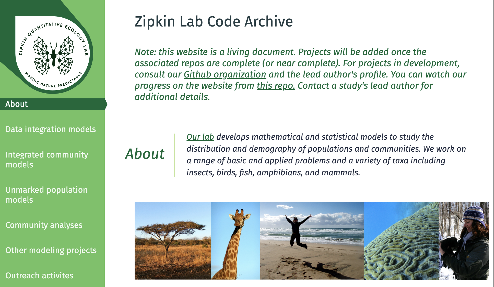

# Adding papers to the Zipkin Lab code archive front-facing page
---

Here are the steps and information to add a new GitHub repository to the [Zipkin Lab Code Archive](https://zipkinlab.github.io/) front-face page, if you are one of the 'GitHub people'. 

The lab archive is the website where all our code and data can 'live through eternity', and where we can direct people who ask about our analysis or data. The [Lab Code Archive](https://github.com/zipkinlab/zipkinlab.github.io) is a single repository that lives within the [Zipkin Lab's GitHub](https://github.com/zipkinlab) page. It creates and links the [Zipkin Lab Archive website](https://zipkinlab.github.io/) to all other repositories that are stored in the lab GitHub. 

<div align="center">

</div>

---

## These are the steps:

### 1 - Fork personal repository to Zipkin Lab GitHub

All repositories should be on the Zipkin Lab GitHub and linked from there (not from personal GitHub accounts) to the front-facing page. So step one is **forking** someone's repository into it.

- Navigate to the repository you want to fork.
- Click the **Fork** button (top-right of the page).
- Choose the owner and name for the fork: it should be **ZIPKINLAB**, not your own.
- You can also change the repository name at this stage.
- Click **Create fork**.

---

### 2 - Gather required information

There are two documents to use as references (available on the [Zipkin Lab Teams GitHub page](https://teams.microsoft.com/l/channel/19%3A15762ca26189456f989a45136b141e94%40thread.tacv2/GitHub?groupId=a1e331a0-3ad7-4671-a13e-3629dea6fd3b&tenantId=22177130-642f-41d9-9211-74237ad5687d)):

- A checklist to track added papers:  
  [GithubProjects.xlsx](https://michiganstate.sharepoint.com/:x:/r/sites/STUOT-ResearchGroup/Shared%20Documents/GitHub/GithubProjects.xlsx)

- A document with detailed instructions:  
  [Github Project Checklist.docx](https://michiganstate.sharepoint.com/:w:/r/sites/STUOT-ResearchGroup/Shared%20Documents/GitHub/Github%20Project%20Checklist.docx)

---

### 3 - Edit the front-facing page

- Edits are done in the [index.html](https://github.com/zipkinlab/zipkinlab.github.io/blob/master/index.html) file.
- Insert your new HTML block **within the appropriate paper category** (e.g., community models, unmarked population models).
- New papers go at the top of the section.
- You can add information manually, or use the code automation below:

#### Automated version:

- The paper metadata goes into the [github_dat.csv](https://michiganstate.sharepoint.com/:x:/r/sites/STUOT-ResearchGroup/Shared%20Documents/GitHub/github_dat.csv) file. Just download it and substitute the fields with the details of the paper you want to add.
 
  <details>
  <summary>Click to see code that creates github_dat.csv</summary>

  ````r
  library(tidyverse)

  dat <- tibble(
    data = c("section", "citation", "title", "year", "journal", "fig_height", "fig_width", "abstract", 
            "author1", "github1", "author2", "github2", "author3", "github3", "author4", "github4", 
            "numb_authors", "doi", "doi_addr"),
    info = c("Data integration models", "Davis_etal_2025_EcoApps", 
            "Evaluating environmental drivers and synchrony of Arctic shorebird demographic rates to inform conservation management", 
            "2025", "Ecological Applications", "2128", "2193", 
            "Environmental factors affect the population dynamics of migratory species throughout their annual cycles. However, identifying the", 
            "Davis, K.L.", "https://github.com/davisk93", "Lanctot, R.B.", "NA", "Saalfeld, S.T.", "NA", 
            "Zipkin, E.F.", "https://github.com/zipkinlab", "4", "10.1111/2041-210X.14282", 
            "https://besjournals.onlinelibrary.wiley.com/doi/full/10.1111/2041-210X.14282")
  )
  ````
  </details>
<div align="center">

</div>

-  Now that you have the new `github_dat.csv` file in your working directory, run [github_html.r](https://michiganstate.sharepoint.com/:u:/r/sites/STUOT-ResearchGroup/Shared%20Documents/GitHub/github_html.r) to create the HTML code snippets that should be added to [index.html](https://github.com/zipkinlab/zipkinlab.github.io/blob/master/index.html).

    <details>
    <summary>Click to see code from github_html.r</summary>

    ````r
    ## code to create html file for the lab front-facing page

    library(glue)
    library(tidyverse)

    dat <- read_csv("github_dat.csv")

    # Match section name to ID
    id_codes <- c("icm", "dataintegration", "other", "community", "unmarked")
    id_names <- c("Integrated community models", "Data integration models", "Other projects", "Community analyses", "Unmarked population models")

    id_cd <- cbind(id_codes, id_names) %>% as_tibble()
    this_id <- pull(dat[which(dat$data == "section"),2])
    id <- paste0(gsub(" ", "",tolower(id_cd[which(id_cd$id_names == this_id),1])),
                dat[which(dat$data == "year"),2],
                toupper(substr(dat[which(dat$data == "author1"),2],1,1)))

    citation <- dat[which(dat$data == "citation"),2] %>% pull()
    figure <- glue("assets/images/{citation}.png")
    git_repo <- glue("https://github.com/zipkinlab/{citation}")
    title <- pull(dat[which(dat$data == "title"),2])
    fig_height <- as.numeric(pull(dat[which(dat$data == "fig_height"),2]))
    fig_width <- as.numeric(pull(dat[which(dat$data == "fig_width"),2]))

    FigSize <- function(OriginalWidth, OriginalHeight, OutputWidth = 200){
      WidthRatio <- OutputWidth / OriginalWidth
      OutputHeight <- OriginalHeight * WidthRatio
      return(list(round(OutputWidth), round(OutputHeight)))
    }

    res_fig <- FigSize(fig_width, fig_height)
    fig_width2 <- res_fig[[1]][1]
    fig_height2 <- res_fig[[2]][1]

    journal <- pull(dat[which(dat$data == "journal"),2])
    year <- pull(dat[which(dat$data == "year"),2])
    doi <- pull(dat[which(dat$data == "doi"),2])
    doi_addr <- pull(dat[which(dat$data == "doi_addr"),2])
    abstract <- pull(dat[which(dat$data == "abstract"),2])
    numb_authors <- as.numeric(pull(dat[which(dat$data == "numb_authors"),2]))

    # Build author list with optional GitHub links
    ht2 <- c()
    for(i in 1:numb_authors){
      author <- pull(dat[dat$data == paste0("author", i), 2])
      github <- pull(dat[dat$data == paste0("github", i), 2])
      if (is.na(github)) {
        ht2 <- c(ht2, paste0(author, ifelse(i < numb_authors, ", ", "")))
      } else {
        link <- glue("<a href='{github}'>{author}</a>")
        ht2 <- c(ht2, ifelse(i == numb_authors && i > 1, paste0("and ", link), paste0(link, ", ")))
      }
    }

    authors_html <- paste(ht2, collapse = "")
    html_content <- glue("
    <h3 id='{id}'>{citation}</h3>
    <section class='example'>
      <section class='title'>
        <h1>{title}</h1>
        
      </section>
      <section class='content'>
        <p><strong>Citation</strong> - {authors_html} ({year}) {title}. <em>{journal}</em>. <a href='{doi_addr}'>DOI: {doi}</a></p>
        <p><strong>Abstract</strong> - {abstract}</p>
        <p><strong>Code and Data</strong> - <a href='{git_repo}'>Link to repo</a></p>
      </section>
    </section>
    ")

    writeLines(html_content, "git_text.txt")
    writeLines(glue("<em> <a href='#{id}'>{citation}</a></em> |"), "git_title.txt")
    ````

    </details><br>
- Paste the text from `git_text.txt` and `git_title.txt` into the `index.html` file (you have to hit 'edit' and commit it!). <br>
 
- Add a figure (.PNG) to the [assets/images/](https://github.com/zipkinlab/zipkinlab.github.io/tree/master/assets/images) folder on GitHub. The figure name should match the citation (e.g., `Zipkin_etal_2025_MEE.png`).

---

### 4 - Add metadata to the `Archived-data` repository

- Upload the relevant data/code links to the [Archived-data repo](https://github.com/zipkinlab/Archived-data).

---

#### Open the [Zipkin Lab Code Archive](https://zipkinlab.github.io/) to check if your edits are correct and... 

## 🎉 YAY, you are done!!!
---
**Author:** Bruna Amaral  
